# 스타벅스 백은지 과제제출물
## 목차

* [1번 문항] &lt;header&gt; 영역 
* [2번 문항] section #banner1
* [3번 문항] section #riddon
* [4번 문항] section #sbu-rw
* [5번 문항] section #banner2
* [6번 문항] section #banner3
* [7번 문항] section #banner4
* [8번 문항] section #banner5
* [9번 문항] section #banner6
* [10번 문항]  &lt;footer&gt; 영역 
<br>
<br>
<br>
<br>
<br>
<br>
<br>
<br>
<br>
<br>
<br>
<br>
<br>
<br>
<br>
<br>

## 1. &lt;header&gt; 영역

* &lt;header&gt; 영역 구조 
 

 * header
   * header-wrap
     * h1 .logo 
       * img
     * div #qucik-gnb
       * ul > li * 4
     * div .ico-search
       * img
     * nav 
       * div.ul #gnb
         * li .gnb[num]
           * a
           * div.sub-gnb
             * div .subGnb-top
               * subGnb-inner
                 * ul .subGNb
                   * li .gnb[num]-sub[num]
                     * a.sub-tit
                     * ul.sub-list
                       * li
             * div .subGub-btm
               *  subGnb-inner
                  *  h3
                  *  p
<br>

### 1-1 header 소스코드

 

> HTML
```html
    <!-- 
        @ Filename index.html
        @ Author 백은지(bej2560183089@gmail.com)
        @ Description 스타벅스 로고
     -->
        <header>
        <div class="header-wrap clearfix">
        ...
        </div>
        </header>
```

> CSS
```css
/*
@ Filename header.css
@ Author 백은지(bej2560183089@gmail.com)
@ Description 스타벅스 페이지 header 영역
              / header-wrap 으로 content 가운데로 정렬
*/

/* header */
header {
    width: 100%;
    height: 123px;
    background-color: #f6f5ef;
    border-top: 2px solid #000;
    border-bottom: 1px solid #e5e5e5;
    position: fixed;
    top: 0px;
    z-index: 10;
}

/* header wrap */
header>div.header-wrap {
    width: 1100px;
    height: 120px;
    margin: 0 auto;
    position: relative;
}

```

<br>

### 1-2 h1 .logo 소스코드


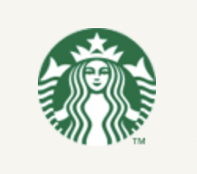

> HTML
```html
    <!-- 
        @ Filename index.html
        @ Author 백은지(bej2560183089@gmail.com)
        @ Description 스타벅스 로고
     -->
            <h1 class="logo">
                
            </h1>
```

> CSS
```css
/*
@ Filename header.css
@ Author 백은지(bej2560183089@gmail.com)
@ Description 스타벅스 페이지 로고 영역 CSS
*/


header>div.header-wrap h1.logo {
    height: 75px;
    width: 75px;
    text-align: center;
    position: absolute;
    top: 22px;
}

```
<br>

### 1-3 div .quick-gnb + div.ico-search

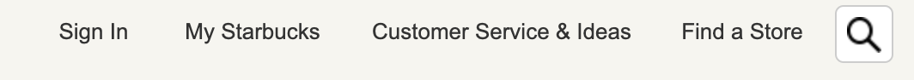

> HTML
```html
    <!-- 
        @ Filename index.html
        @ Author 백은지(bej2560183089@gmail.com)
        @ Description 스타벅스 맨 상단 메뉴 html 위치 조정을 위해 검색 아이콘은 별도로 작성
     -->
                <ul>
                    <li class="li1 pull-left"><a href="">Sign In</a></li>
                    <li class="li2 pull-left"><a href="">My Starbucks</a></li>
                    <li class="li3 pull-left"><a href="">Customer Service & Ideas</a></li>
                    <li class="li4 pull-left"><a href="">Find a Store</a></li>
                </ul>
            </div>
            <a class="ico-search" href="">
            
                </a>
```

> CSS
```css
/*
@ Filename header.css
@ Author 백은지(bej2560183089@gmail.com)
@ Description quick-gnb css 파일
*/


/* quick-gnb */
div.header-wrap>div#quick-gnb {
    position: absolute;
    top: 15px;
    right: 93px;
    height: 20px;
    width: 464px;
}

#quick-gnb ul {
    height: 0px;
}

div.header-wrap>#quick-gnb li {
    display: inline-block;
    height: 100%;
    text-align: center;
    margin-right: 1px;
}

/* 각 li 사이즈 설정 */
div.header-wrap>#quick-gnb .li1 {
    width: 76px;
    height: 20px;
}

div.header-wrap>#quick-gnb .li2 {
    width: 107px;
    height: 20px;
}

div.header-wrap>#quick-gnb .li3 {
    width: 181px;
    height: 20px;
}

div.header-wrap>#quick-gnb .li4 {
    width: 97px;
    height: 20px;
    margin: 0%;
}

/* li a 공통설정 */
#quick-gnb li>a {
    font-family: Arial, georgia;
    display: block;
    width: 100%;
    height: 100%;
    font-size: 13px;
    line-height: 20px;
    color: #333;
    text-decoration: none;
}

/* a hover 이벤트 지정 */
#quick-gnb li:hover a {
    text-decoration: underline;
}

/* search icon */
.header-wrap>.ico-search {
    display: block;
    position: absolute;
    right: 54px;
    top: 9px;
    width: 32px;
    height: 32px;
    border-radius: 5px;
    border: 1px solid #ccc;
    background-color: #fff;
    text-align: center;
    line-height: 32px;
}

.header-wrap>.ico-search img {
    display: block;
    margin: 6px auto;
}

```
<br>

### 1-4-1 nav > ul #gnb 영역


> HTML
```html
    <!-- 
        @ Filename index.html
        @ Author 백은지(bej2560183089@gmail.com)
        @ Description gnb 영역 중 sub-gnb 를 제외한 gnb의 Html
     -->
      <nav class="clearfix">
                <!-- gnb -->
                <ul id="gnb" class="pull-right clearfix">
                    <!--gnb-coffee-->
                    <li class="gnb1 pull-left">
                        <a href="#" class="clearfix">COFFEE</a>
                    </li>
                </ul>
            </nav>
```  

> CSS
```css
/*
@ Filename header.css
@ Author 백은지(bej2560183089@gmail.com)
@ Description nav , gnb 영역과 #gnb > li 에 적용된 css
*/

/* nav */
.header-wrap>nav {
    height: 66px;
    width: 100%;
    position: absolute;
    top: 57px;
}

.header-wrap>nav>ul#gnb {
    height: 66px;
    width: 750px;

}

.header-wrap>nav>ul>li {
    display: block;
    height: 66px;
}

.header-wrap>nav>ul>li>a {
    width: 100%;
    padding-top: 10px;
    height: 56px;
    display: block;
    font-size: 13px;
    line-height: 20px;
    color: #333;
    text-align: center;
    text-decoration: none;
    font-family: Avenir, Arial, georgia;
}

.header-wrap>nav>ul>li:hover>a {
    color: #669900;
    background-color: #2c2a29;
    text-decoration: underline;
}


/* hover 이벤트 */
#gnb>li:hover>.gnb-sub {
    display: block;
}
```

** &lt;li&gt; 별 설정 **

> CSS
```css

/*
@ Filename header.css
@ Author 백은지(bej2560183089@gmail.com)
@ Description nav , gnb 영역과 #gnb > li 뱔로 적용된 css
*/

* gnb1 */

#gnb>.gnb1 {
    display: block;
    width: 89px;
    height: 56px;
}

#gnb>.gnb1>.gnb1-sub {
    height: 535px;
}

#gnb>.gnb1>.gnb1-sub .subGnb-top {
    display: block;
    height: 356px;
}

#gnb>.gnb1>.gnb1-sub .subGnb-btm {
    display: block;
    height: 106px;
}

/* gnb2 */
#gnb>.gnb2 {
    width: 73px;
    height: 56px;
}

#gnb>.gnb2 .gnb2-sub {
    height: 364px;
}

#gnb>.gnb2 .subGnb-top {
    height: 229px;
}

#gnb>.gnb2 .subGnb-btm {
    height: 62px;
}


/* gnb3 */
#gnb>.gnb3 {
    width: 79px;
    height: 56px;
}

#gnb>.gnb3 .gnb3-sub {

    height: 210px;
}

#gnb>.gnb3 .subGnb-top {
    height: 75px;
}

#gnb>.gnb3 .subGnb-btm {
    height: 62px;
}

/* gnb4 */
#gnb>.gnb4 {
    width: 153px;
    height: 56px;
}

#gnb>.gnb4 .gnb4-sub {
    height: 236px;
}

#gnb>.gnb4 .subGnb-top {
    height: 163px;
}

#gnb>.gnb4 .subGnb-btm {
    height: 0;
}

/* gnb5 */
#gnb>.gnb5 {
    width: 225px;
    height: 56px;
}

#gnb>.gnb5 .gnb5-sub {
    height: 298px;
}

#gnb>.gnb5 .subGnb-top {
    height: 163px;
}

#gnb>.gnb5 .subGnb-btm {
    height: 62px;
}

/* gnb6 */
#gnb>.gnb6 {
    width: 131px;
    height: 56px;
}

#gnb>.gnb6 .gnb6-sub {
    height: 381px;
}

#gnb>.gnb6 .subGnb-top {
    height: 202px;
}

#gnb>.gnb6 .subGnb-btm {
    height: 106px;
}

```
<br>

### 1-4-2 div.sub-gnb 영역 > subGnb-top 과 subGnb-btm


> HTML
```html
   <!-- 
        @ Filename index.html
        @ Author 백은지(bej2560183089@gmail.com)
        @ Description 
        sub-gnb 영역 top과 bottom 영역으로 나누어지고 안에서 영역을 다시 잡기위해 Inner 영역이 있음
        
        Top 에는 subGnb 리스트들이 있고 Btm은 h3와 p로 구성되어짐

     -->
      <div class="gnb-sub gnb1-sub">
            <!-- submenu wrap -->
            <div class="subGnb-top">
                <!-- submenu top -->
                <div class="subGnb-inner">
                    <!-- sub gnb -->
                    <ul class="subGnb">
                        <li class="gnb1-sub1">
                        </li>
                        <li>
                        </li>
                        ....
                    <ul>
                </div>
                    <!-- subgnb bottom-->
            <div class="subGnb-btm">
                <div class="subGnb-inner">

                    <h3><a class="subGnb-btm-link" href="">나와 어울리는 커피찾기</a></h3>
                    <p class="subGnb-btm-txt">스타벅스가 여러분에게 어울리는 커피를 찾아드립니다.</p>
                    <h3><a class="subGnb-btm-link" href="">최상의 커피를 즐기는 법</a></h3>
                    <p class="subGnb-btm-txt">여러가지 방법을 통해 다양한 풍미의 커피를 즐겨보세요</p>
                </div>
            </div>

            </div>

```

> CSS
```css
/*
@ Filename header.css
@ Author 백은지(bej2560183089@gmail.com)
@ Description sub-gnb 영역 CSS
*/

/* header gnb-sub 공통사항 */
header nav #gnb .gnb-sub {
    display: none;
    width: 100vw;
    position: fixed;
    top: 123px;
    left: 0;
}

/* subGnb-top 영역 */
.subGnb-top {
    width: 100%;
    padding: 20px 0px;
    background-color: #2C2A29;
}

/* subGnb bottom */
.subGnb-btm {
    padding: 5px 0px 20px 0px;
    background-image: url(img/gnb_sub_txbg.jpg);
}

/* subGnb 공통 적용 */
.subGnb-inner {
    width: 1100px;
    margin: 0 auto;
    height: 100%;
}


/* bottom h3 */
.subGnb-btm>.subGnb-inner>h3 {
    margin-top: 20px;
}

.subGnb-btm>.subGnb-inner>h3:nth-child(3) {
    margin-top: 0px;
}

/* h3 > a */
.subGnb-btm>.subGnb-inner>h3>a {
    display: block;
    font-size: 12px;
    color: #999;
    text-decoration: none;
    line-height: 18px;
}


.subGnb-btm>.subGnb-inner>p {
    line-height: 18px;
    color: #669900;
    font-size: 12px;
}

/* bottom 영역 호버 이벤트 */
.subGnb-btm>.subGnb-inner>h3:hover>a {
    text-decoration: underline;
}

```
<br>

### 1-4-3 div.sub-gnb 안에 메뉴 영역


>HTML
```html
   <!-- 
        @ Filename index.html
        @ Author 백은지(bej2560183089@gmail.com)
        @ Description subGnb 안에 메뉴부분 html
     -->
<ul class="subGnb">
    <li class="gnb2-sub1">
        <a class="sub-tit" href="">음료</a>
        <ul class="sub-list">
            <li><a href="">콜드 블루</a></li>
            <li><a href="">브루드 커피</a></li>
            <li><a href="">에스프레소</a></li>
            <li><a href="">에스프레소</a></li>
            <li><a href="">에스프레소</a></li>
            <li><a href="">에스프레소</a></li>
            <li><a href="">에스프레소</a></li>
            <li><a href="">에스프레소</a></li>
        </ul>
    </li>
```
>CSS
```css
/*
@ Filename header.css
@ Author 백은지(bej2560183089@gmail.com)
@ Description sub-gnb 영역안에 메뉴부분  CSS
*/

.subGnb {
    display: flex;
    height: 100%;
    flex-flow: row wrap;
    align-content: space-between;
}

.subGnb>li {
    flex-basis: 220px;
    width: 220px;
}

.sub-tit {
    display: block;
    font-size: 14px;
    line-height: 14px;
    padding: 3px 0px 12px 0px;
    font-weight: bold;
    text-decoration: none;
    color: #fff;

}

.sub-list>li {
    display: block;
    padding: 3px 0px 3px 0px;
    line-height: 16px;
    height: 16px;
}

.sub-list>li>a {
    font-size: 12px;
    color: #999;
    text-decoration: none;
}

/* 호버이벤트 */
.sub-list>li:hover>a {
    color: #999;
    text-decoration: underline;
}

.sub-tit:hover {
    text-decoration: underline;
    color: #fff;

}

```
<br>

## 2. section #banner1 

  * section #banner1
    * div .banner1-inner
      * div.m-2021-xmas
        * img
      * div.m-2021-drink1
        * img
      * div.m-2021-drink2
        * img
      * div.m-2021-drink3
        * img
      * div.btn-sp 
        * a

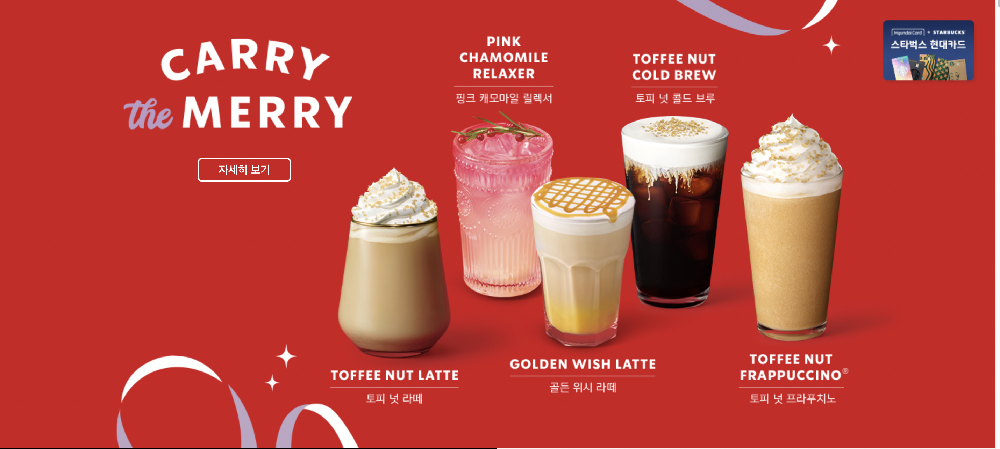

> HTML
```html
   <!-- 
        @ Filename index.html
        @ Author 백은지(bej2560183089@gmail.com)
        @ Description 메인 영역과 배너 1번 html
     -->
      <main>
        <div class="hundaiCard">
            
        </div>

        <section id="banner1">
            <div class="banner1-inner">
                <div class="m-2021-xmas">
                    
                </div>
                <div class="m-2021-drink1">
                    
                </div>
                <div class="m-2021-drink2">
                    
                </div>
                <div class="m-2021-drink3">
                    
                </div>
                <div class="btn-sp">
                    <a href="">자세히 보기</a>
                </div>
            </div>
        </section>
```


> CSS
```css
/*
@ Filename main.css
@ Author 백은지(bej2560183089@gmail.com)
@ Description main 영역과 배너 1번 CSS
*/

/* header fixed 로 Header 만큼 내리기 */
main {
    position: relative;
    top: 123px;
}


/* 오른쪽 현대카드 이미지 고정 */
main>.hundaiCard {
    position: fixed;
    top: 154px;
    left: 54.5%;
    margin-left: 485px;
    z-index: 999;
}

/* 배너1의 영역 */
main>#banner1 {
    background-color: #d1131d;
    width: 100%;
    height: 646px;
}


/* 배너1 이너 영역 */
main>#banner1>.banner1-inner {
    width: 1080px;
    height: 100%;
    margin: 0 auto;
    position: relative;
}


/* 배너1의 가상선택자로 배경이미지 삽입 */
main>#banner1>.banner1-inner::before {
    content: "";
    width: 348px;
    height: 150px;
    display: block;
    background-image: url(img/2021_chiristmas_bg_left.png);
    background-position: 50% 100%;
    background-size: contain;
    background-repeat: no-repeat;
    position: absolute;
    left: -5px;
    bottom: 0;
}

main>#banner1>.banner1-inner::after {
    content: "";
    width: 348px;
    height: 84px;
    display: block;
    background-image: url(img/2021_chiristmas_bg_right.png);
    background-position: 50% 0%;
    background-size: contain;
    background-repeat: no-repeat;
    position: absolute;
    right: -5px;
    top: 0;
}


/* 첫번째 이미지 영역 잡기 */
#banner1 .m-2021-xmas {
    position: absolute;
    top: 54px;
    margin: 5px;
    width: 328px;
    transition: opacity 0.5s ease-in;
}

#banner1 .m-2021-xmas img {
    width: 100%;
}


/* 두번째 이미지 영역 */
#banner1 .m-2021-drink1 {
    position: absolute;
    top: 242px;
    left: 299px;

    width: 295px;
    height: 291px;
    transition: opacity 0.1s ease-in;
}

#banner1 .m-2021-drink1 img {
    width: 100%;
}

/* 세번째 이미지 영역 */
#banner1 .m-2021-drink2 {
    position: absolute;
    top: 56px;
    left: 450px;

    width: 503px;
    height: 511px;
    transition: opacity 0.1s ease-in;
}

#banner1 .m-2021-drink2 img {
    width: 503px;
}

/* 네번째 이미지 영역 */
#banner1 .m-2021-drink3 {
    position: absolute;
    top: 166px;
    left: 886px;

    width: 236px;
    height: 417px;
    transition: opacity 0.5s ease-in;
}

/* 버튼 영역 사이즈  */
#banner1 .btn-sp {
    position: absolute;
    top: 230px;
    left: 15px;
    width: 328px;
    height: 38px;
    text-align: center;
    transition: opacity 0.5s ease-in;
}

#banner1 .btn-sp a {
    display: block;
    width: 129px;
    height: 30px;
    line-height: 30px;
    margin: 0 auto;
    color: #fff;
    border: 2px solid #fff;
    border-radius: 5px;
    text-decoration: none;
}

/* 버튼 호버 이벤트 */
#banner1 .btn-sp:hover a {
    display: block;
    width: 129px;
    height: 30px;
    line-height: 30px;
    margin: 0 auto;
    color: #fff;
    border: 2px solid #fff;
    background-color: rgba(255, 255, 255, 0.4);
    border-radius: 5px;
    text-decoration: none;
}

```
> Javascript
```js

/*
@ Filename index.js
@ Author 백은지(bej2560183089@gmail.com)
@ Description 배너1에 페이지 로드시 이미지가 뜨는 효과  
*/

const banner1 = document.querySelector("#banner1");

const bn1_Items = banner1.querySelectorAll("div:not(.banner1-inner)");

console.log(bn1_Items);

// 배너1의 모든 아이템에 opacity 0 적용
bn1_Items.forEach((v, i) => {
    v.style.opacity = "0";
})

// 페이지 로드시 배열 순서대로 opacity 변경 
window.addEventListener("load", e => {
    bn1_Items.forEach((v, i) => {
        ;
        setTimeout(() => {
            v.style.opacity = "1";
        }, 800 * (i + 1));
    })
})

```
<br>

## 3. section riddon

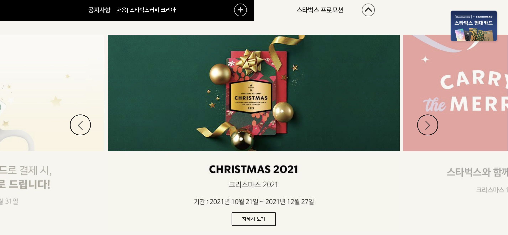

* section #riddon
  * div .notice
    * ribbon-inner
      * span .notice-tit
      * a .notice-cnt
      * a .notice-btn
  * div .promotion
    * ribbon-inner
      * promotion-btn
        * img

<br>

###  3-1 리본영역
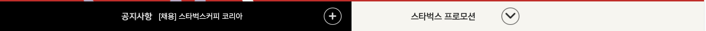


> HTML
```html
   <!-- 
        @ Filename index.html
        @ Author 백은지(bej2560183089@gmail.com)
        @ Description 리본영역 html
     -->
       <section id="ribbon" class="clearfix">
            <div class="notice pull-left">
                <div class="ribbon-inner">
                    <span class="notice-tit">공지사항</span>
                    <a href="#" class="notice-cnt">[채용] 스타벅스커피 코리아</a>
                    <a class="notice-btn" href="">bg=btn-notice</a>
                </div>
            </div>
            <div class="promotion pull-right clearfix">
                <div class="ribbon-inner">
                    <a class="promotion-btn">
                        
                        </a>
                </div>
            </div>
        </section>
```

> CSS
```css
/*
@ Filename main.css
@ Author 백은지(bej2560183089@gmail.com)
@ Description 리본 영역 CSS
*/

/* riddon */

#ribbon {
    width: 100%;
    height: 62px;
}

/* ribbon commom */
.ribbon-inner {
    display: flex;
    width: 100%;
    height: 100%;
    flex-direction: row;
    justify-content: end;
}

#ribbon span {
    height: 18px;
    line-height: 18px;
    margin: 22px 0px;
}


/* ribbon notice */
#ribbon .notice {
    height: 100%;
    width: 50%;
    background-color: black;
}


/* 리본 왼쪽 공지사항 타이틀 */
#ribbon .notice-tit {
    text-indent: -222222px;
    overflow: hidden;
    color: #fff;
    flex-basis: 64px;
    background-image: url(img/notice_ttl.png);
    background-repeat: no-repeat;
}

#ribbon .notice-cnt {
    flex-basis: 300px;
    color: #fff;
    margin: 22px 13px;
    text-decoration: none;
}

/* 리본 왼쪽 공지사항 내용 호버시 이벤트 */
#ribbon .notice-cnt:hover {
    text-decoration: underline;
}


#ribbon .notice-btn {
    text-indent: -9999px;
    overflow: hidden;
    background-image: url(img/btn_notice_plus.png);
    background-size: contain;
    width: 36px;
    height: 36px;
    margin: 13px 20px;
}

/* 리본 오른쪽 프로모션 영역 */
#ribbon .promotion {
    height: 100%;
    width: 50%;
    background-color: #f6f5ef
}

#ribbon .promotion .ribbon-inner {
    justify-content: start;
}

#ribbon .promotion .promotion-btn {
    width: 284px;
    height: 36px;
    margin: 13px 100px;
}

#ribbon .promotion .promotion-btn img:first-child {
    width: 129px;
    height: 17px;
    margin: 9px 40px 9px 20px;
}

#ribbon .promotion .promotion-btn img:nth-child(2) {
    width: 36px;
    height: 36px;
    margin: 0 10px;
}

```

> Javascript
```js

/*
@ Filename index.js
@ Author 백은지(bej2560183089@gmail.com)
@ Description 리본 오른쪽 프로모션 버튼 클릭시 슬라이트 표시 이벤트 설정
*/


// riddon

const btnProm = document.querySelector("#btn-prom");
const slide = document.querySelector("#slide");


//riddon prom click event
btnProm.addEventListener("click", e => {
    const slideVw = slide.style.display;
    if (slideVw == "none") {
        btnProm.setAttribute("src", "img/btn_prom_up.png");
        slide.style.display = "block";

    } else if (slideVw != "none") {
        btnProm.setAttribute("src", "img/btn_prom_down.png");
        slide.style.display = "none";
    }
});


```
<br>

## 3-2 슬라이드 영역

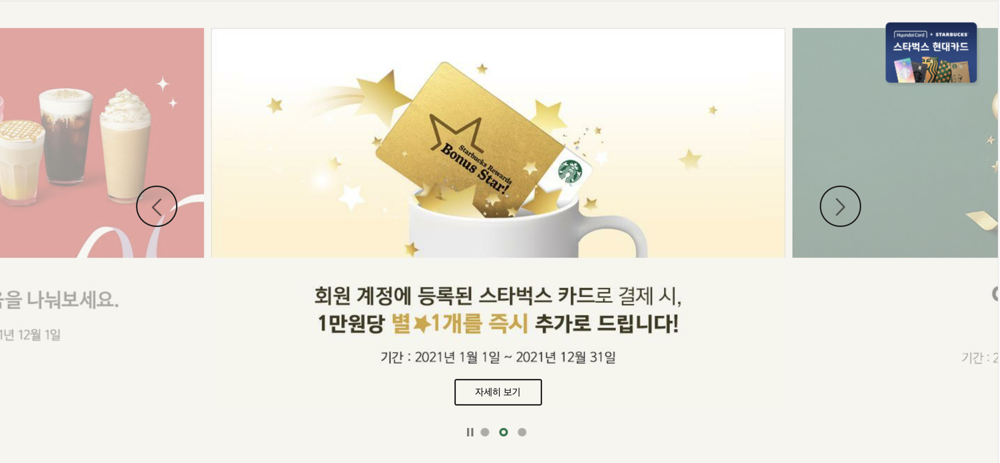

> HTML
```html
   <!-- 
        @ Filename index.html
        @ Author 백은지(bej2560183089@gmail.com)
        @ Description 프로모션 버튼 클릭시 뜨는 슬라이드
     -->
      <!-- prom btn 클릭시, prom slide -->
        <section id="slide" class="slide">
            <div class="slide-wrap">
                <!-- slide list -->
                <ul class="slide-li clearfix">
                    <li class="slide1 slide-active">
                        
                        <a class="btn-slideSp" href="">자세히 보기</a>
                    </li>
                    <li class="slide2 slide-next">
                        
                        <a class="btn-slideSp" href="">자세히 보기</a>
                    </li>
                    <li class="slide3 slide-prev">
                        
                        <a class="btn-slideSp" href="">자세히 보기</a>
                    </li>
                </ul>
                <!-- slide btn -->
                <div class="slide-btn clearfix">
                    <!-- div로 원만들기 radious 27.5px -->
                    <div class="btn-prev pull-left"></div>
                    <div class="btn-next pull-right"></div>
                </div>
            </div>

            <!-- slide index -->
            <div class="slide-index">
                <div class="btn-control btn-stop"></div>
                <ul>
                    <li class="index1"></li>
                    <li class="index2"></li>
                    <li class="index3"></li>
                </ul>
            </div>
        </section>

```

> CSS
```css
/*
@ Filename main.css
@ Author 백은지(bej2560183089@gmail.com)
@ Description 프로모션 버튼 클릭시 슬라이드 영역 CSS
*/

/* promotion slide */


/* 슬라이드 상태 */

/* 슬라이드 활성시, order 2 */
.slide-active {
    opacity: 1!important;
    order: 2;
}

/* 슬라이드 활성시, order 3 */
.slide-next {
    order:3;
}

/* 슬라이드 활성시, order 1 */
.slide-prev {
    order:1;
}

 /* 슬라이드 영역 */
#slide {
    display: none;
    background-color: #f6f5ef;
    width: 100%;
    height: 659px;
    padding-top: 39px;
    overflow: hidden;
}

/* 슬라이드 이너 */
#slide>.slide-wrap {
    width: 1100px;
    height: 541px;
    margin: 0 auto;
    position: relative;
}


/* 슬라이드 리스트 */
#slide>.slide-wrap>.slide-li {
    display: flex;
    flex-direction: row;
    width: 2487px;
    position: relative;
    left: -694px;
    position: relative;
}

/* 슬라이드 영역 */
#slide>.slide-wrap>.slide-li> li {
    height: 541px;
    flex-basis: 819px;
    margin: 0 5px;
    opacity: 0.4;
    transition: all 0.3s ease-in-out;
}

#slide>.slide-wrap>.slide-li>li>img {
    width: 819px;
    height: 553px;
}

#slide>.slide-wrap>.slide-li>li>a {
    position: relative;
    bottom: 5px;
    display: block;
    width: 121px;
    height: 34px;
    margin: -50px auto 0px auto;
    font-size: 14px;
    border: 2px solid #222;
    color: #222;
    text-decoration: none;
    border-radius: 3px;
    text-align: center;
    line-height: 34px;
}


/* 슬라이드 호버시, 이벤트 */
#slide>.slide-wrap>.slide-li>li>a:hover {
    background-color: #222;
    border: 2px solid #222;
    color: #fff;
    text-decoration: underline;
    transition: background-color 0.5s ease-in-out;
}


/* slide - btn */
#slide>.slide-wrap>.slide-btn {
    position: absolute;
    top: 225px;
    width: 100%;
}

#slide>.slide-wrap>.slide-btn>div {
    width: 55px;
    height: 55px;
    border: 2px solid #222;
    border-radius: 30px;
    text-align: center;
    opacity: 1;
    transition: background-color 0.5s ease-in-out;
}

/* 슬라이드 버튼 호버시, 이벤트 */
#slide>.slide-wrap>.slide-btn>div:hover {
    background-color: rgba(256, 256, 256, 0.8);
}

.slide-btn .btn-prev {
    margin-left: 33px;
}

.slide-btn .btn-next {
    margin-right: 33px;
}

#slide>.slide-wrap>.slide-btn>div>img {
    width: 15px;
    height: 26px;
    margin: 16px 0;
}

/* slide-index */
#slide>.slide-index {
    position: relative;
    bottom: -30px;
    margin: auto;
    width: 1100px;
    height: 12px;
    display: flex;
    flex-direction: row;
    justify-content: center;
}

#slide>.slide-index>.btn-control {
    width: 9px;
    height: 12px;
}

/* 스톱버튼 */
.btn-stop {
    background-image: url(img/main_prom_stop.png);
}

/* 플레이버튼 */
.btn-play {
    background-image: url(img/main_prom_play.png);
}


/* 인덱스 */
#slide>.slide-index>ul {
    display: block;
    margin-left: 5px;
    height: 12px;
    position: relative;
    top: -3px;
}

/* 인덱스 리스트 */
#slide>.slide-index>ul>li {
    display: inline-block;
    width: 12px;
    height: 12px;
    margin: 0 5px;
}

```

> Javascript
```js
/*
@ Filename index.js
@ Author 백은지(bej2560183089@gmail.com)
@ Description 리본 오른쪽 프로모션 버튼 클릭시 슬라이트 이벤트
*/

// slide 
const btnPrev = slide.querySelector(".btn-prev");
const btnNext = slide.querySelector(".btn-next");

// slide 리스트
const slideItems = slide.querySelectorAll(".slide-li > li");

console.log(slideItems);

// slide-index 
const slideIndex = slide.querySelectorAll(".slide-index > ul > li");

// slide control
const slideControl = slide.querySelector(".btn-control");


// 슬라이드 3초마다 자동 변경
const slideChange = setInterval(() => {
    console.log("function on")
    slideItems.forEach((v, i) => {
        const slideActive = v.classList.contains("slide-active");
        const slideNext = v.classList.contains("slide-next");
        const slidePrev = v.classList.contains("slide-prev");

        if (slideActive) {
            v.classList.remove("slide-active");
            v.classList.add("slide-prev");
            slideIndex[i].querySelector("img").setAttribute("src","img/main_prom_off.png");
        } else if (slideNext) {
            v.classList.remove("slide-next");
            v.classList.add("slide-active");
            slideIndex[i].querySelector("img").setAttribute("src","img/main_prom_on.png");
        } else if (slidePrev) {
            v.classList.remove("slide-prev");
            v.classList.add("slide-next");
        }
    })

}, 3000);

// 클릭시, 플레이버튼 배경 변경 -> 자동 슬라이드 변경 멈춤
 slideControl.addEventListener("click", e =>{
  slideControl.classList.toggle("btn-stop");
  slideControl.classList.toggle("btn-play");
  
  const contain_check = slideControl.classList.contains("btn-stop");

  if(!contain_check){
      clearInterval(slideChange);
  } else {
    setInterval(() => {
        console.log("function on")
        slideItems.forEach((v, i) => {
            // 아이템에 클래스가 포함되어 있는지 
            const slideActive = v.classList.contains("slide-active");
            const slideNext = v.classList.contains("slide-next");
            const slidePrev = v.classList.contains("slide-prev");
    
            // 아이템에 클랙스가 있는지 검사
            if (slideActive) {
                // 있다면 클래스 제거
                v.classList.remove("slide-active");
                // 클래스 변경
                v.classList.add("slide-prev");
                // 슬라이드 리스트에 이미지 변경
                slideIndex[i].querySelector("img").setAttribute("src","img/main_prom_off.png");
            } else if (slideNext) {
                v.classList.remove("slide-next");
                v.classList.add("slide-active");
                slideIndex[i].querySelector("img").setAttribute("src","img/main_prom_on.png");
            } else if (slidePrev) {
                v.classList.remove("slide-prev");
                v.classList.add("slide-next");
            }
        })
    
    }, 3000);
  }
})


//btnPrev click evnet
btnPrev.addEventListener("click", e => {
    //버튼 클릭시 슬라이드 자동 변경 멈춤
    clearInterval(slideChange);
    slideItems.forEach((v, i) => {
        const slideActive = v.classList.contains("slide-active");
        const slideNext = v.classList.contains("slide-next");
        const slidePrev = v.classList.contains("slide-prev");
        
        // 아이템에 클랙스가 있는지 검사
        if (slideActive) {
             // 있다면 클래스 제거
            v.classList.remove("slide-active");
            // 클래스변경
            v.classList.add("slide-next");
            // 슬라이드 인덱스 이미지 변경
            slideIndex[i].querySelector("img").setAttribute("src","img/main_prom_off.png");
        } else if (slideNext) {
            v.classList.remove("slide-next");
            v.classList.add("slide-prev");
        } else if (slidePrev) {
            v.classList.remove("slide-prev");
            v.classList.add("slide-active");
            slideIndex[i].querySelector("img").setAttribute("src","img/main_prom_on.png");
        }
    })
})


//btnNext click evnet
btnNext.addEventListener("click", e => {
    //버튼 클릭시 슬라이드 자동 변경 멈춤
   clearInterval(slideChange);
    slideItems.forEach((v, i) => {
        const slideActive = v.classList.contains("slide-active");
        const slideNext = v.classList.contains("slide-next");
        const slidePrev = v.classList.contains("slide-prev");

        if (slideActive) {
            v.classList.remove("slide-active");
            v.classList.add("slide-prev");
            slideIndex[i].querySelector("img").setAttribute("src","img/main_prom_off.png");
        } else if (slideNext) {
            v.classList.remove("slide-next");
            v.classList.add("slide-active");
            slideIndex[i].querySelector("img").setAttribute("src","img/main_prom_on.png");
        } else if (slidePrev) {
            v.classList.remove("slide-prev");
            v.classList.add("slide-next");
        }
    })

})

<br>

```

## 4. section #sbu-rw

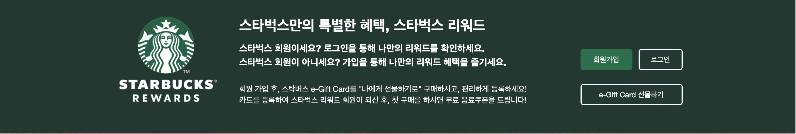

* section #sbu-rw
  * div .inner
    * div .rw-logo
      * img
    * div .rw-content
      * rw-top
        * h2
        * p
        * p
        * button
      * rw-btm
        * p
        * p
        * button

> HTML
```html

    <!-- 
        @ Filename index.html
        @ Author 백은지(bej2560183089@gmail.com)
        @ Description 스타벅스 리워드 영역
     -->

        <!-- 스타벅스 리워드 영역 -->
        <section id="sbu-rw">
            <div class="inner">
                <div class="rw-logo">
                    
                </div>
                <div class="rw-content">
                    <div class="rw-top">
                        <h2>스타벅스만의 특별한 혜택, 스타벅스 리워드</h2>
                        <p><strong>스타벅스 회원이세요? 로그인을 통해 나만의 리워드를 확인하세요.</strong></p>
                        <p><strong>스타벅스 회원이 아니세요? 가입을 통해 나만의 리워드 혜택을 즐기세요.</strong></p>
                        <button class="rw-join">회원가입</button>
                        <button class="rw-login">로그인</button>
                    </div>
                    <div class="rw-btm">
                        <p>회원 가입 후, 스탁버스 e-Gift Card를 "나에게 선물하기로" 구매하시고, 편리하게 등록하세요!</p>
                        <p>카드를 등록하여 스타벅스 리워드 회원이 되신 후, 첫 구매를 하시면 무료 음료쿠폰을 드립니다!</p>
                        <button class="rw-eGift">e-Gift Card 선물하기</button>
                    </div>
                </div>
            </div>
        </section>
```

> CSS
```css

/*
@ Filename main.css
@ Author 백은지(bej2560183089@gmail.com)
@ Description 스타벅스 리워드 영역 
*/

/* sbu-rw */

main>#sbu-rw {
    width: 100%;
    height: 170px;
    padding: 30px 0px 40px 0px;
    background-color: #1e3932;
}

/*  이너 */
#sbu-rw>.inner {
    width: 1080px;
    height: 100%;
    margin: auto;
    display: flex;
    align-content: center;
}

/* 로고영역 */
#sbu-rw>.inner>.rw-logo {
    flex-basis: auto;
    margin: 0 40px;
    width: 16.3%;
    text-align: center;
}

#sbu-rw>.inner>.rw-logo>img {
    width: 176px;
}


/* 오른쪽 content 영역 */
#sbu-rw>.inner>.rw-content {
    width: 824px;
}

/*  오른쪽 양역 탑영역 */
#sbu-rw>.inner>.rw-content>.rw-top {
    height: 108px;
    width: 794px;
    margin-bottom: 12px;
    position: relative;

    border-bottom: 1px solid #fff;
}

.rw-content>.rw-top>h2 {
    color: #fff;
    font-size: 26px;
    margin-bottom: 12px;
}

.rw-content>.rw-top>p {
    font-size: 17px;
    line-height: 1.4;
    color: #fff;
}

/*  오른쪽 양역 탑영역 */
.rw-content>.rw-top>button {
    display: block;
    position: absolute;
    right: 0;
    bottom: 12px;
    height: 38px;

    color: #fff;
    border-radius: 5px;
}

/* 마우스 호버시, 이벤트 설정 */
.rw-content>.rw-top> button:hover {
   text-decoration: underline;
}

.rw-content>.rw-top > button.rw-join {
    width: 93px;
    right: 90px;
    background-color: #00704a;
    border: 2px solid #00704a;

}

.rw-content>.rw-top>button.rw-login {
    width: 79px;
    border: 2px solid #fff;
    background-color: transparent;
}

.rw-content>.rw-btm {
    height: 40px;
    width: 794px;

    font-size: 14px;
    line-height: 1.4;
    color: #fff;

    position: relative;
}

.rw-content>.rw-btm > button {
    height: 38px;
    width: 183px;

    border: 2px solid #fff;
    border-radius: 5px;
    background-color: transparent;
    color: #fff;

    position: absolute;
    right: 0;
    top: 0;
}

/* 마우스 호버시, 이벤트 */
.rw-content>.rw-btm > button:hover {
   text-decoration: underline;
}

```

## 5. section #banner2
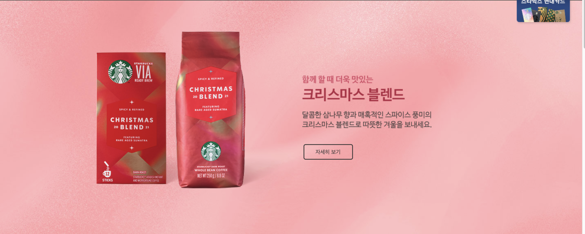

* section #banner2
  * inner
    * img
    * img
    * button

>HTML
```html
  <!-- 
        @ Filename index.html
        @ Author 백은지(bej2560183089@gmail.com)
        @ Description 스타벅스 커피콩 배너 영역 HTML
     -->

    <section id="banner2">
        <div class="inner">
            
            
            <button class="bn2-right bn2-go-sp">자세히 보기</button>
        </div>
    </section>

```
> CSS
```css

/*
@ Filename main.css
@ Author 백은지(bej2560183089@gmail.com)
@ Description 스타벅스 커비콩 배너 영역 CSS
*/


/* banner2 */
#banner2 {
    width: 100%;
    height: 573px;

    background-image: url(img/2021_christmas_bean_bg.jpg);
}

/* 배너2 이너 */
#banner2>.inner {
    width: 1080px;
    height: 100%;

    margin: 0 auto;
    text-align: center;
    position: relative;

}


#banner2>.inner>img:first-child {
    display: inline-block;
    position: absolute;
    top: 0;
    left: -700px;
    width: 484px;
    height: 422px;
    margin: 75.5px 0px;
    transition: transform 0.8s ease-in-out;
}


#banner2>.inner>img:nth-child(2) {
    display: inline-block;
    position: absolute;
    top: 184px;
    right: -700px;
    transition: transform 0.8s ease-in-out;
}


#banner2>.inner>button {
    position: absolute;
    top: 352px;
    right: -700px;
    border: 2px solid #453d3d;
    border-radius: 5px;
    color: #453d3d;
    width: 121px;
    height: 38px;
    background-color: transparent;
    transition: background-color 0.5s ease-in;
    transition: transform 0.8s ease-in-out;
}

/* 버튼 이벤트  */
#banner2>.inner>button:hover {
    border: 2px solid #453d3d;
    background-color: #453d3d;
    color: #fff;
    text-decoration: underline;
}

```
>Javascript
```js
/*
@ Filename index.js
@ Author 백은지(bej2560183089@gmail.com)
@ Description 일정 스크롤 위치에서 요소가 양옆에서 이동
*/


/*-- #banner2 -*/
const banner2 = document.querySelector("#banner2");
const bn2Left = document.querySelector(".bn2-left");
const bn2Right = document.querySelectorAll(".bn2-right");

console.log(banner2.getBoundingClientRect());
console.log(bn2Right[0].getBoundingClientRect());


window.addEventListener("scroll", e => {
      console.log(window.scrollY);

      //스크롤 100 이상이면 요소에 위치를 변경
     if(window.scrollY > 100){
        bn2Left.style.transform ="translateX(763px)";
        bn2Right[0].style.transform ="translateX(-897px)";
        bn2Right[1].style.transform ="translateX(-1089px)";
    
     }

});

```

<br>

## 6. section #banner3
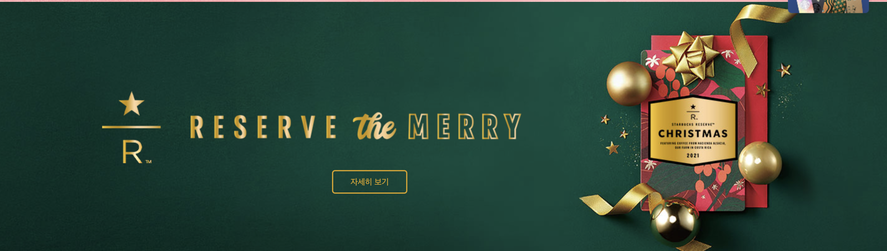

* section #banner
  * div .inner
    * img
    * button


> HTML
```html
  <!-- 
        @ Filename index.html
        @ Author 백은지(bej2560183089@gmail.com)
        @ Description 스타벅스 reserve 배너 HTML
     -->

        <section id="banner3">
            <div class="inner">
                
                <button class="b3-go-sp">자세히 보기</button>
            </div>
        </section>
```

> CSS
```css
/*
@ Filename main.css
@ Author 백은지(bej2560183089@gmail.com)
@ Description 스타벅스 reserve 배너 CSS
*/


/* banner3 */
#banner3 {
    height: 400px;
    width: 100%;
    background-image: url(img/reserve_christmas_bean_211018.jpg);
    background-size: cover;
    background-repeat: no-repeat;
    background-position: center;
}

#banner3>.inner {
    width: 1100px;
    height: 100%;
    margin: auto;
    position: relative;
}

#banner3>.inner>img {
    position: relative;
    top: 143px;
}

#banner3>.inner>button {
    width: 121px;
    height: 38px;
    background-color: transparent;
    color: #d5a012;
    border: 2px solid #d5a012;
    border-radius: 5px;

    position: absolute;
    top: 270px;
    left: 370.5px;
    transition: background-color 0.5s ease-in;
}

/* 버튼 마우시 호버시, 이벤트 */
#banner3>.inner>button:hover {
   background-color: #d5a012;
    color: #fff;
    border: 2px solid #d5a012;
    text-decoration: underline;
}
```

<br>

## 7. section #banner4


* section #banner4
  * div .inner
    * img
    * img
    * button
    * img

>HTML
```html
  <!-- 
        @ Filename index.html
        @ Author 백은지(bej2560183089@gmail.com)
        @ Description 스타벅스 픽업 페이보릿 배너
     -->
     <section id="banner4">
            <div class="inner">
                
                
                <button class="bn4-go-sp">자세히 보기</button>
                
            </div>
        </section>
```
>CSS
```css
/*
@ Filename main.css
@ Author 백은지(bej2560183089@gmail.com)
@ Description 스타벅스 픽업 페이보릿 배너 CSS
*/

/* banner4 */
#banner4 {
    width: 100%;
    height: 800px;

    background-image: url(img/fav_prod_bg_new.jpg);
    background-position: center;
    background-attachment: fixed;
    background-repeat: no-repeat;
    background-size: auto 100%;

}

#banner4>.inner {
    width: 1250px;
    height: 800px;
    margin: auto;
    position: relative;
}

#banner4>.inner>img:first-child {
    display: block;
    position: absolute;
    top: 120px;
    left: -700px;
    transition: transform 0.8s ease-in-out;

}

#banner4>.inner>img:nth-child(2) {
    display: block;
    position: absolute;
    top: 370px;
    left: -700px;
    transition: transform 0.8s ease-in-out;
}

#banner4>.inner>button {
    display: block;
    position: absolute;
    top: 570px;
    left: -700px;

    width: 121px;
    height: 38px;

    background-color: transparent;
    border: 2px solid #fff;
    border-radius: 3px;
    color: #fff;

    font-size: 14px;
    transition: background-color 0.5s ease-in;
    transition: transform 0.8s ease-in-out;
}

#banner4>.inner>button:hover {
    background-color: #fff;
    border: 2px solid #fff;
    color: #cecece;
    text-decoration: underline;
}

#banner4>.inner>img:nth-child(4) {
    display: block;
    position: absolute;
    top: 100px;
    left: 618px;
}

```
>Javascript
```js
/*
@ Filename index.js
@ Author 백은지(bej2560183089@gmail.com)
@ Description 일정 스크롤 위치에서 요소가 왼쪽에서 이동
*/


/** bn4 */
const bn4Img1 = document.querySelector("#banner4 > .inner > img:first-child");
const bn4Img2 = document.querySelector("#banner4 > .inner > img:nth-child(2)");
const bn4Btn = document.querySelector("#banner4 > .inner > button ");


window.addEventListener("scroll", e => {
        if(window.scrollY > 1360){
        bn4Img1.style.transform ="translateX(900px)";
        bn4Img2.style.transform ="translateX(792px)";
        bn4Btn.style.transform ="translateX(1028px)";
     }
});

```

<br>

## 8. section #banner5

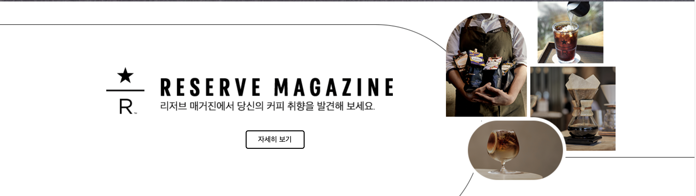

* section #banner5
  * inner
    * img
    * img
    * button

>HTML
```html
  <!-- 
        @ Filename index.html
        @ Author 백은지(bej2560183089@gmail.com)
        @ Description 스타벅스 리저브 매거진 배너 HTML
     -->

        <section id="banner5">
            <div class="inner">
                
                
                <button class="bn5-go-sp">자세히 보기</button>
            </div>
        </section>
```
>CSS
```css
/*
@ Filename main.css
@ Author 백은지(bej2560183089@gmail.com)
@ Description 스타벅스 리저브 매거진 배너
*/

/* banner5 */
#banner5 {
    overflow: hidden;
    width: 100%;
    height: 400px;

    background-image: url(img/reserve_bg_pc.png);
    background-repeat: no-repeat;
    background-position: 50% 100%;
    background-size: auto 353px;
}

#banner5>.inner {
    height: 100%;
    width: 1100px;
    margin: 0 auto;

    position: relative;
}

#banner5>.inner>img:first-child {
    position: absolute;
    top: 135px;
    left: 55px;

}

#banner5>.inner>img:nth-child(2) {
    position: absolute;
    top: 0px;
    right: 0px;
}

#banner5>.inner>.bn5-go-sp {
    height: 38px;
    width: 121px;
    font-size: 15px;

    color: #000;
    border: 2px solid #000;
    border-radius: 5px;
    background-color: transparent;

    position: absolute;
    top: 265px;
    left: 341px;

    transition: background-color 0.5s ease-in;
}

#banner5>.inner>.bn5-go-sp:hover {
    color: #fff;
    border: 2px solid #000;
    background-color: #000;
    text-decoration: underline;

}

```

<br>

## 9. section #banner6

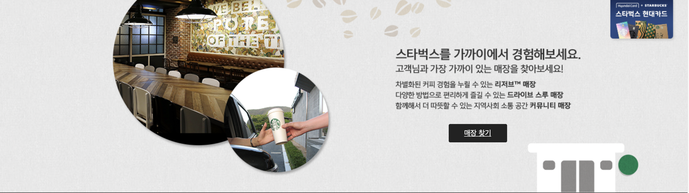

* section #banner6
  * div .inner
    * img1
    * img2
    * img3
    * img4
    * img5
    * img6
    * button
  

> HTML
```html
  <!-- 
        @ Filename index.html
        @ Author 백은지(bej2560183089@gmail.com)
        @ Description 스타벅스 스토어 배너 HTML
     -->

    <section id="banner6">
        <div class="inner">
            
            
            
            
            
            
            <button class="find-store">매장 찾기</button>
        </div>
    </section>

```
> CSS
```CSS
/*
@ Filename main.css
@ Author 백은지(bej2560183089@gmail.com)
@ Description 스타벅스 스토어 배너 CSS
*/

/* banner6 */
#banner6 {
    overflow: hidden;
    width: 100%;
    height: 400px;

    background-image: url(img/store_bg.jpg);
}

#banner6 > .inner {
    width: 1280px;
    height: 100%;
    margin: auto;
    position: relative;
}

#banner6 >  .inner > img:nth-child(2) {
    position: absolute;
    top: 140px;
    left: 390px;

}

#banner6 >  .inner > img:nth-child(1) {
    position: absolute;
    top: 0;
    left: 160px;
}


#banner6 >  .inner > img:nth-child(3) {
    position: absolute;
    top: -60px;
    left: 520px;
}


#banner6 >  .inner > img:nth-child(4) {
    position: absolute;
    top: 298px;
    left: 1020px;
}

/* righ:149px */
#banner6> .inner > img:nth-child(5) {
    position: absolute;
    top: 100px;
    right: -700px;
    transition: transform 0.8s ease-in-out;
}

/* right 168px */
#banner6> .inner > img:nth-child(6) {
    position: absolute;
    top: 168px;
    right: -700px;
    transition: transform 0.8s ease-in-out;
}

/* right:402px */
#banner6> .inner > button {
    position: absolute;
    top: 258px;
    right: -700px;

    font-size: 15px;

    width: 121px;
    height: 38px;
    border: 2px solid #222;
    background-color: transparent;
    border-radius: 3px;
    transition: background-color 0.5s ease-in;
    transition: transform 0.8s ease-in-out;
}

/* 버튼 마우스호버 이벤트 */
#banner6> .inner > button:hover {
    border: 2px solid #222;
    background-color: #222;
    color: #fff;
    text-decoration: underline;
}


```
> Javascript
```js
/*
@ Filename index.js
@ Author 백은지(bej2560183089@gmail.com)
@ Description 일정 스크롤 위치에서 요소가 오른쪽에서 이동
*/

// bn6
const banner6 = document.querySelector("#banner6");
const bn6Img5 = banner6.querySelector(".inner > img:nth-child(5)");
const bn6Img6 = banner6.querySelector(".inner > img:nth-child(6)");
const bn6Btn = banner6.querySelector(".inner > button");


window.addEventListener("scroll", e => {
         if(window.scrollY >2420){
        bn6Img5.style.transform ="translateX(-849px)";
        bn6Img6.style.transform ="translateX(-868px)";
        bn6Btn.style.transform ="translateX(-1002px)";
     }
});
```

<br>

## 10. &lt;footer&gt; 영역


* footer
  * div .inner
    * div .ft-gnb
      * ul .com
      * ul 
  * section #footer-award
    * div .footer-award-wrap
      * 
  * section #footer-aside
    * ul
    * ftas-btn-wrap
    * address

### 10-3 footer > div.inner 

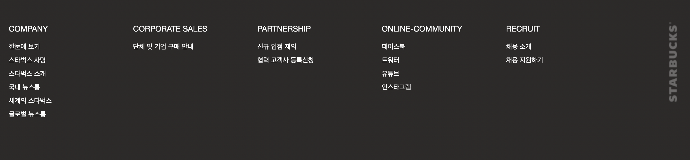

>HTML 
```html 

  <!-- 
        @ Filename index.html
        @ Author 백은지(bej2560183089@gmail.com)
        @ Description 스타벅스 footer 중 메뉴 부분
     -->

<footer>
        <div class="inner">
            <div class="ft-gnb">
                <ul class="company">
                    <li class="ftGnb-tit">COMPANY</li>
                    <li><a href="">한눈에 보기</a></li>
                    <li><a href="">스타벅스 사명</a></li>
                    <li><a href="">스타벅스 소개</a></li>
                    <li><a href="">국내 뉴스룸</a></li>
                    <li><a href="">세계의 스타벅스</a></li>
                    <li><a href="">글로벌 뉴스룸</a></li>
                </ul>
                <ul class="corp-sales">
                    <li class="ftGnb-tit">CORPORATE SALES</li>
                    <li><a href="">단체 및 기업 구매 안내</a></li>
                </ul>
                <ul class="partnership">
                    <li class="ftGnb-tit">PARTNERSHIP</li>
                    <li><a href="">신규 입점 제의</a></li>
                    <li><a href="">협력 고객사 등록신청</a></li>
                </ul>
                <ul class="online-com">
                    <li class="ftGnb-tit">ONLINE-COMMUNITY</li>
                    <li><a href="">페이스북</a></li>
                    <li><a href="">트워터</a></li>
                    <li><a href="">유튜브</a></li>
                    <li><a href="">인스타그램</a></li>
                </ul>
                <ul class="recruit">
                    <li class="ftGnb-tit">RECRUIT</li>
                    <li><a href="">채용 소개</a></li>
                    <li><a href="">채용 지원하기</a></li>
                </ul>
            </div>
        </div>

        ..
        </footer>
```

>CSS
```css
/*
@ Filename footer.css
@ Author 백은지(bej2560183089@gmail.com)
@ Description footer 중 메뉴부분 CSS
*/

/* footer */

footer {
    height: 534px;
    width: 100%;
    padding: 32px 0 35px 0;
    position: relative;
    top: 123px;

    background-color: #2C2A29;
    color: #fff;
}

footer > .inner {
    width: 1182px;
    margin: 0 auto;

    background-image: url(img/footer_logo.png);
    background-position: right 8px;
    background-repeat: no-repeat;
}

/* ft-gnb */

footer > .inner > .ft-gnb {
    width: 100%;
    height: 214px;

    display: flex;
    flex-direction: row;
    justify-content: flex-start;
}


footer > .inner >.ft-gnb > ul {
    flex-basis: 220px;
    margin-bottom: 30px;
}


.ft-gnb > ul > li > a {
    text-decoration: none;
    font-size: 12px;
    line-height: 24px;
    color: #fff;
}

/* 모든리스트 마우스 호버시 이벤트 */
.ft-gnb > ul > li:hover > a {
    text-decoration: underline;
}


.ft-gnb > ul > li.ftGnb-tit {
  display: block;
  font-size: 14px;
  line-height: 40px;
}

/* 타이틀 영역 마우서 호버시 이벤트 */
.ft-gnb > ul > li.ftGnb-tit:hover {
  text-decoration: underline;
  }

```
### 10-2 #footer-award


>HTML 
```html

  <!-- 
        @ Filename index.html
        @ Author 백은지(bej2560183089@gmail.com)
        @ Description 
     -->

       <!-- footer Bg 로고 -->
        <section id="footer-award">
            <div class="footer-award-wrap">
                
                
                
                
                
                
            </div>
        </section>

```

>CSS
```css
/*
@ Filename footer.css
@ Author 백은지(bej2560183089@gmail.com)
@ Description 스타벅스 스토어 배너 CSS
*/
/* footer award */

#footer-award {
    width: 100%;
    height: 80px;
    margin-top: 40px;
    padding-top: 20px;
    background-color: #282828;
}

#footer-award > .footer-award-wrap {
    width: 1182px;
    height: 40px;
    margin: auto;
    padding-bottom: 20px;

    display: flex;
    flex-direction: row;
    align-items: center;
}

#footer-award > .footer-award-wrap > img {
    flex-basis: 158px;
    height: 40px;
}
```
## 10-3 #footer-aside 

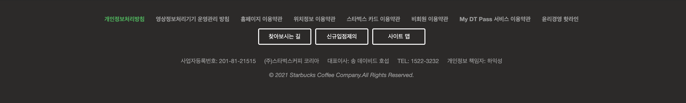

>HTML 
```html
  <!-- 
        @ Filename index.html
        @ Author 백은지(bej2560183089@gmail.com)
        @ Description footer 중 맨 하단 부분 HTML
     -->

 <section id="footer-aside">

            <ul>
                <li class="personal-info"><a href="">개인정보처리방침</a></li>
                <li><a href="">영상정보처리기기 운영관리 방침</a></li>
                <li><a href="">홈페이지 이용약관</a></li>
                <li><a href="">위치정보 이용약관</a></li>
                <li><a href="">스타벅스 카드 이용약관</a></li>
                <li><a href="">비회원 이용약관</a></li>
                <li><a href="">My DT Pass 서비스 이용약관</a></li>
                <li><a href="">윤리경영 핫라인</a></li>
            </ul>


            <div class="ftas-btn-wrap">
                <button class="btn-ftas">찾아보시는 길</button>
                <button class="btn-ftas">신규입점제의</button>
                <button class="btn-ftas">사이트 맵</button>
            </div>

            <address>
                <div class="com-info">
                    <span>사업자등록번호: 201-81-21515</span>
                    <span>(주)스타벅스커피 코리아</span>
                    <span>대표이사: 송 데이비드 호섭</span>
                    <span>TEL: 1522-3232</span>
                    <span>개인정보 책임자: 하익성</span>
                </div>

                <div class="copy">
                    &copy; 2021 Starbucks Coffee Company.All Rights Reserved.
                </div>
            </address>
        </section>

```

>CSS
```css
/*
@ Filename footer.css
@ Author 백은지(bej2560183089@gmail.com)
@ Description footer 중 맨 상단 부분 CSS
*/

/* footer-silde */

#footer-aside {
    width: 100%;
    height: 150px;
    padding-top: 30px;

    color: #999;
    font-size: 12px;
    line-height: 18px;
    text-align: center;
}

#footer-aside > ul {
    display: block;
    height: 18px;
    margin: 0 auto;
    text-align: center;
}

#footer-aside > ul > li {
    display: inline-block;
    height: 100%;
    padding: 0 10px;
}

#footer-aside > ul > li > a{
    color: #999;
    display: block;
    text-decoration: none;
    font-weight: bold;
    font-size: 12px;
}

#footer-aside > ul > li:hover > a{
    text-decoration: underline;
}

#footer-aside > ul > .personal-info > a {
    color: #00b050;
}

/* footer btn */

#footer-aside .ftas-btn-wrap button {
    font-size: 12px;
    color: #fff;
    background-color: transparent;
    margin: 10px 2px 0px 3px;
   
    width: 110px;
    height: 34px;

    border: 2px solid #fff;
    border-radius: 3px;
}

/* 버튼 마우스 호버시 이벤트 */
#footer-aside .ftas-btn-wrap button:hover {
  text-decoration: underline;
}

/* address */

#footer-aside address {
    width: 100%;
    text-align: center;
    height: 18px;
    padding: 25px 0 5px 0;
}

#footer-aside > address > .com-info {
    height: 100%;
}

#footer-aside > address > .com-info > span {
    display: inline-block;
    margin: 0 7px;
    font-style: normal;
}

#footer-aside > address > .copy {
    display: inline-block;
    line-height: 40px;
}


```

### 전체 실행화면


